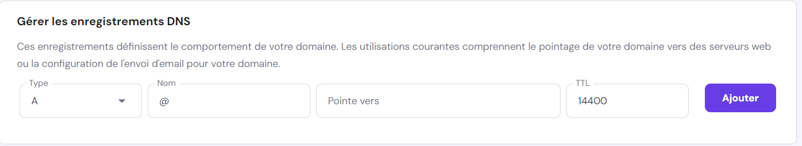

# Déploiement

## Réservation du nom de domaine

### Questions

1) Expliquer la procédure pour réserver un nom de domaine chez OVH avec des captures d'écran (arrêtez-vous au paiement) :

Se rendre sur OVHCloud, cliquer sur "nom de domaine"

Rechercher le nom de domaine voulu.
Vérifier les disponibilités des extensions. (.fr .com .de .en etc...)
Séléctionner le ou les noms de domaine souhaités. 

Procéder au paiement.

2. Comment faire pour qu'un nom de domaine pointe vers une adresse IP spécifique ?

Il faut avoir un service d'hébergement, puis paramétrer les DNS pour faire pointer votre nom de domaine vers votre adresse IP.
La redirection DNS peut prendre quelques heures (jusqu'à 24h parfois) pour être active et pointer sur la bonne adresse IP.
En cas d'achat d'un nom de domaine et d'un hébergement sur la même plateforme, la redirection DNS est déjà effectuée.

 (Editeur de Zone DNS d'Hostinger)

## Préparation du VPS

Se connecter à la machine distante en ssh avec le terminal.  
"ssh root@172.16.1.212"
On rentre le mot de passe : "ac826c8t"

Installer aapanel ou cloudpanel ou autre via le powershell
Visiter le site d'aapanel pour avoir la ligne de commande d'installlation 

Se connecter à aapanel avec les informations fournies 
https://172.16.1.212:27775/25291a40
username : lzgikdnd
password : ce5d613a

Installer Nginx ou Apache, les deux sont proposés. 
Attendre la fin de l'installation de Nginx 

Prévoir une installation de php.

sudo apt-get update
sudo apt-get upgrade

sudo apt-get install php
php -v

Il faut maintenant créer un nouveau repository.
Initialiser un dépôt git vide.
git init depot

git remote add vps ssh://root@172.16.1.212/var/depot

Push les changements.

git push -u vps master ?

Maintenant que aapanel a enfin terminé d'installer Nginx il faut créer le nouveau site.

Cliquer sur l'onglet Website 
Cliquer sur le bouton Add site 
Rentrer le nom de domaine correspondant 
Créer le site.

Todo...
